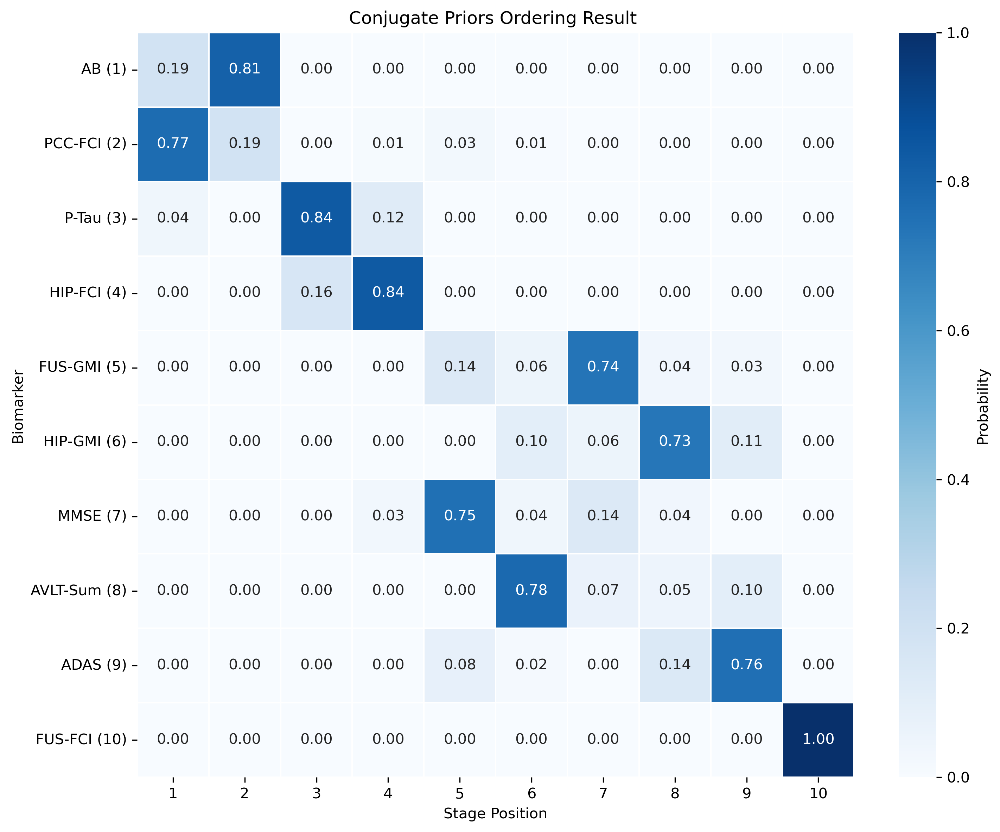
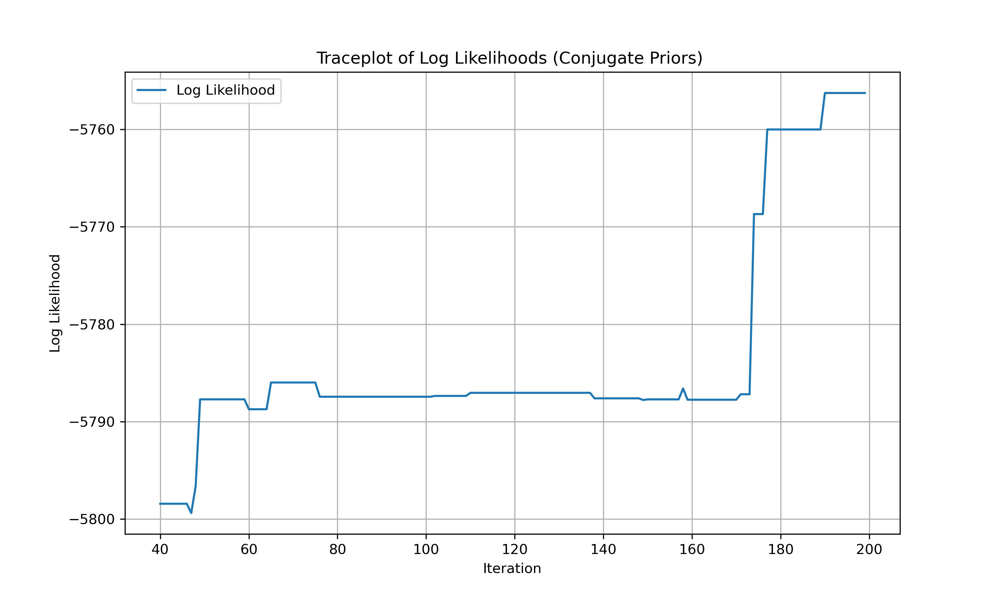

# `pysaebm`

`pysaebm` is a Python package for generating and analyzing biomarker data using Stage-Aware Event-Based Modeling (SA-EBM). It supports various data generation experiments and EBM algorithms to estimate biomarker orderings and disease stages. This package is designed for researchers and data scientists working with biomarker progression analysis.

For detailed methodology, refer to [our paper](https://saebm.hongtaoh.com/).


## Installation

Install `fastsaebm` using pip:

```bash
pip install fastsaebm
```

Ensure you have Python 3.8+ and the required dependencies installed. For a full list of dependencies, see `requirements.txt`.


## Data generation


Examples of how to generate data are at [./pysaebm/test/gen.py](./pysaebm/test/gen.py).


Because in each generation, the ordering is randomized, you will see a `true_order_and_stages.json` that tells you the corresponding true stages and true order for each output csv file.


The source codes for data generation can be seen in [./pysaebm/data_generate.py](./pysaebm/data_generate.py).


This is the full `generate` parameters:


```py
def generate(
   experiment_name: str = "sn_kjOrdinalDM_xnjNormal",
   params_file: str = 'params.json',
   js: List[int] = [50, 200, 500, 1000],
   rs: List[float] = [0.1, 0.25, 0.5, 0.75, 0.9],
   num_of_datasets_per_combination: int = 50,
   output_dir: str = 'data',
   seed: Optional[int] = None,
   dirichlet_alpha: Optional[Dict[str, List[float]]] = {
       'uniform': [100],
       'multinomial': [0.4013728324975898,
                       1.0910444770153345,
                       2.30974117596663,
                       3.8081194066281103,
                       4.889722107892335,
                       4.889722107892335,
                       3.8081194066281103,
                       2.30974117596663,
                       1.0910444770153345,
                       0.4013728324975898]
   },
   beta_params: Dict[str, Dict[str, float]] = {
       'near_normal': {'alpha': 2.0, 'beta': 2.0},
       'uniform': {'alpha': 1, 'beta': 1},
       'regular': {'alpha': 5, 'beta': 2}
   },
   prefix: Optional[str] = None,
   suffix: Optional[str] = None,
   keep_all_cols: bool = False,
   fixed_biomarker_order: bool = False,
   noise_std_parameter: float = 0.05,
) -> Dict[str, Dict[str, int]]:
```


Explanations:
- `experiment_name` should be one of the these:


```py
experiment_names = [
  "sn_kjOrdinalDM_xnjNormal",     # Experiment 1: Ordinal kj with Dirichlet-Multinomial, Normal Xnj
  "sn_kjOrdinalDM_xnjNonNormal",  # Experiment 2: Ordinal kj with Dirichlet-Multinomial, Non-Normal Xnj
  "sn_kjOrdinalUniform_xnjNormal", # Experiment 3: Ordinal kj with Uniform distribution, Normal Xnj
  "sn_kjOrdinalUniform_xnjNonNormal", # Experiment 4: Ordinal kj with Uniform distribution, Non-Normal Xnj
  "sn_kjContinuousUniform",       # Experiment 5: Continuous kj with Uniform distribution
  "sn_kjContinuousBeta",          # Experiment 6: Continuous kj with Beta distribution
  "xiNearNormal_kjContinuousUniform", # Experiment 7: Near-normal Xi with Continuous Uniform kj
  "xiNearNormal_kjContinuousBeta", # Experiment 8: Near-normal Xi with Continuous Beta kj
  "xiNearNormalWithNoise_kjContinuousBeta", # Experiment 9: Same as Exp 8 but with noises to xi
]
```


You can find the explanation to these terms from [our paper](https://saebm.hongtaoh.com/).


- `params_file`: The path to the parameters in json. Example is [./pysaebm/data/params.json](./pysaebm/data/params.json). You should specify each biomarker's `theta_mean`, `theta_std`, `phi_mean`, and `phi_std`.
- `js`: An array of integers indicating the number of participants you want.
- `rs`: An array of floats indicating the number of healthy ratios.
- `num_of_datasets_per_combination`: The number of repetitions for each j-r combination.
- `output_dir`: The directory where you want to save the generated data.
- `seed`: An integer serving as the seed for the randomness.
- `dirichlet_alpha`: This should be a dictionary where keys are `uniform` and `multinomial`. They correspond to `kjOrdinalUniform` and `kjOrdinalDM`.
- `beta_params`: A dictionary where keys are `near_normal`, `uniform`, and `regular`, corresponding to `xiNearNormal`, `kjContinuousUniform` and `kjContinuousBeta`.
- `prefix`: Optional prefix for the output csv file names.
- `suffix`: Optional suffix for the output csv file names.
- `keep_all_cols`: Whether to include additional metadata columns (k_j, event_time, affected)
- fixed_biomarker_order: If True, will use the order as in the `params_file`. If False, will randomize the ordering.
- noise_std_parameter: the parameter in N(0, N \cdot noise_std_parameter) in experiment 9


Note that you need to make sure the `dirichlet_alpha['multinomial']` has the same length as your params dict (as in your `params_file`).


## Run EBM Algorithms


Examples of how to run algorithms and get results is at [./pysaebm/test/test.py](./pysaebm/test/test.py).


This explains the parameters well enough:


```py
def run_ebm(
   algorithm: str,
   data_file: str,
   output_dir: str,
   output_folder: Optional[str] = None,
   n_iter: int = 2000,
   n_shuffle: int = 2,
   burn_in: int = 500,
   thinning: int = 1,
   true_order_dict: Optional[Dict[str, int]] = None,
   true_stages: Optional[List[int]] = None,
   plot_title_detail: Optional[str] = "",
   fname_prefix: Optional[str] = "",
   skip_heatmap: Optional[bool] = False,
   skip_traceplot: Optional[bool] = False,
   # Strength of the prior belief in prior estimate of the mean (μ), set to 1 as default
   prior_n: float = 1.0,
   # Prior degrees of freedom, influencing the certainty of prior estimate of the variance (σ²), set to 1 as default
   prior_v: float = 1.0,
   bw_method: str = 'scott',
   seed: int = 123,
) -> Dict[str, Union[str, int, float, Dict, List]]:
   """
   Run the metropolis hastings algorithm and save results


   Args:
       algorithm (str): Choose from 'hard_kmeans', 'mle', 'em', 'kde', and 'conjugate_priors'.
       data_file (str): Path to the input CSV file with biomarker data.
       output_dir (str): Path to the directory to store all the results.
       output_folder (str): Optional. If not provided, all results will be saved to output_dir/algorithm.
           If provided, results will be saved to output_dir/output_folder
       n_iter (int): Number of iterations for the Metropolis-Hastings algorithm.
       n_shuffle (int): Number of shuffles per iteration.
       burn_in (int): Burn-in period for the MCMC chain.
       thinning (int): Thinning interval for the MCMC chain.
       true_order_dict (Optional[Dict[str, int]]): biomarker name: the correct order of it (if known)
       true_stages (Optional[List[int]]): true stages for all participants (if known)
       plot_title_detail (Optional[str]): optional string to add to plot title, as suffix.
       fname_prefix (Optional[str]): the prefix of heatmap, traceplot, results.json, and logs file, e.g., 5_50_0_heatmap_conjugate_priors.png
           In the example, there are no prefix strings.
       skip_heatmap (Optional[bool]): whether to save heatmaps. True if you want to skip saving heatmaps and save space.
       skip_traceplot (Optional[bool]): whether to save traceplots. True if you want to skip saving traceplots and save space.
       prior_n (strength of belief in prior of mean): default to be 1.0
       prior_v (prior degree of freedom) are the weakly informative priors, default to be 1.0
       bw_method (str): bandwidth selection method in kde
       seed (int): for reproducibility

   Returns:
       Dict[str, Union[str, int, float, Dict, List]]: Results including everything, e.g., Kendall's tau and p-value.
   """
```


Some extra explanations:


- `n_iter`: In general, above 2k is recommended. 10k should be sufficient if you have <= 10 biomarkers.
- `burn_in` and `thinning`: The idea behind the two parameters is that we will only use some of the results from all iterations in `n_iter`. We will do this: if `(i > burn_in) & (i % thinning == 0)`, then we will use the result from that iteration `i`. Usually, we set `thinning` to be 1.


After running the `run_ebm`, you'll see a folder named as your `output_dir`. Each algorithm will have its subfolders.


The results are organized this way:


- `records` folder contains the loggings.
- `heatmaps` folder contains all the heatmaps. An example is





  Biomarkers in the y-axis are ranked according to the ordering that has the highest likelihood among all iterations. Each cell indicates the probability that a certain biomarker falls in a certain stage. **Note, however, these probabilities are calculated based on all the iterations that satisfy  `(i > burn_in) & (i % thinning == 0)`**.


  In the heatmap, the sum of each col and each row is 1.


- `traceplots` folder contains all the traceplots (starting from iteration 40, not iteration 0). Those plots will be useful to diagnose whether EBM algorithms are working correctly. It's totally okay for the plots to show fluctuation (because biomarker distribution and stage distributions are re-calculated each iterations). You should not, however, see a clear downward trend.





- `results` folder contains all important results in `json`. Each file contains


```py
results = {
        "algorithm": algorithm,
        "runtime": end_time - start_time,
        "N_MCMC": n_iter,
        "n_shuffle": n_shuffle,
        "burn_in": burn_in,
        "thinning": thinning,
        'healthy_ratio': healthy_ratio,
        "max_log_likelihood": float(max(log_likelihoods)),
        "kendalls_tau": tau,
        "p_value": p_value,
        "mean_absolute_error": mae,
        'current_pi': current_pi.tolist(),
        # updated pi is the pi for all stages, including 0
        'updated_pi': updated_pi.tolist(),
        'true_order': true_order_result,
        "order_with_highest_ll": {k: int(v) for k, v in zip(biomarker_names, order_with_highest_ll)},
        "true_stages": true_stages,
        'ml_stages': ml_stages,
        "stage_likelihood_posterior": final_stage_post_dict,
        "final_theta_phi_params": final_theta_phi_dict,
    }
```

- `algorithm` is the algorithm you are running with.
- `runtime` in seconds.
- `N_MCMC` is the number of MCMC iterations.
- `n_shuffle` is how many biomarkers to shuffle places in Metropolis Hastings. Default is 2.
- `burn_in` and `thinning` are explained above.
- `healthy_ratio` is the percentage of non-diseased participants in the dataset.
- `max_log_likelihood` is the max data log likelihood. The script `mh` generates `all_accepted_orders`, `log_likelihoods`, `current_theta_phi`, `current_stage_post`, and `current_pi`. `max_log_likelihoods` is the max of `log_likelihoods`.
- `kendalls_tau` and `p_value` are the result of comparing the `order_with_highest_ll` with the true order (if provided).
- `mean_absolute_error` is the result of comparing `ml_stages` and `true_stages` (if provided). This measurement is for when we include estimation of healthy participants as well. That is to say, we estimate their disease stages without knowing they are healthy.
- `current_pi` is the probability distribution of all disease stages.
- `current_pi` is the probability distribution of all stages, including 0.
- `true_order` is the dictionary explaining the stage each biomarker is at.
- `order_with_highest_ll` is the ordering that corresponds to the `max_log_likelihoods`.
- `true_stages` is an array of each participant's disease stage.
- `ml_stages` is the array of most likely disease stages.
- `true_stages_diseased` is the array of actual stages for diseased participants only.
- `'ml_stages_diseased` is the array of the estimated stages for diseased participants only.
- `stage_likelihood_posterior` is a dictionary detailing each participant's probability in each of the possible stages.
- `final_theta_phi_params` is a dictionary detailing the parameters for each biomarker. If you are using `kde`, you'll see `theta_weights` and `phi_weights`. If you use other algorithms, you will see the `theta_mean`, `theta_std`, `phi_mean` and `phi_std`.


## Use your own data


You are more than welcome to use your own data. After all, the very purpose of `pysaebm` is: to allow you to analyze your own data. However, you do have to make sure that the input data have at least four columns:


- participant: int
- biomarker: str
- measurement: float
- diseased: bool


The `participant` column should be integers from 0 to `J-1` where `J` is the number of participants.


Samples are available at [./pysaebm/data/samples/](./pysaebm/data/samples/).


The data should be in a [tidy format](https://vita.had.co.nz/papers/tidy-data.pdf), i.e.,


- Each variable is a column.
- Each observation is a row.
- Each type of observational unit is a table.


## Change Log

- 2025-08-03 (V 0.0.5)
    - Implemented the numpy version.
    - Implemented numba in functions.

